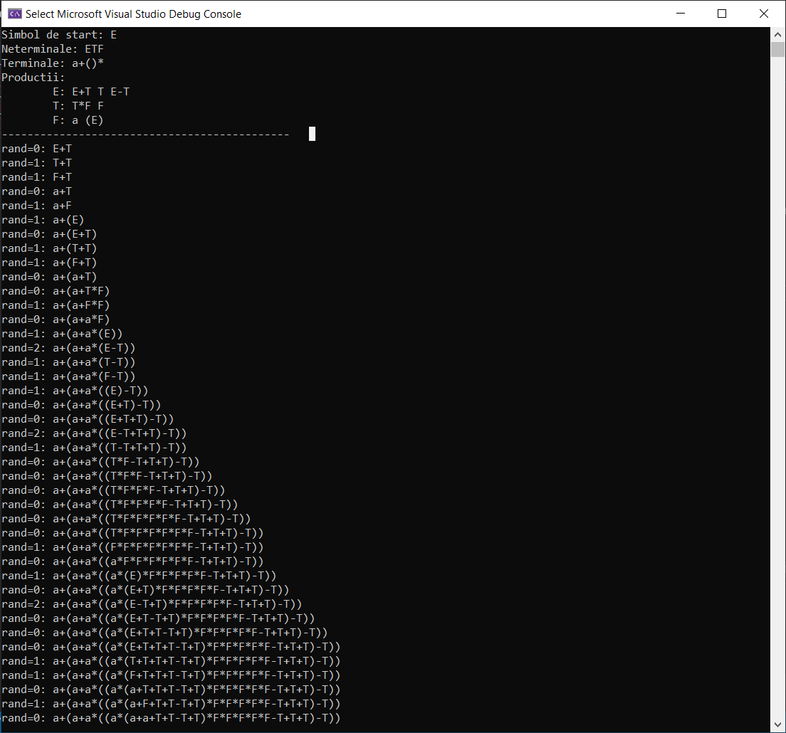

`2020 Series`
# Generare de siruri plecand de la o Gramatica Idependenta de Context
Proiectul numarul 1 de la materia Limbaje Formale si Automate/Translatoare - Calculatoare, Anul 3.

Se va crea un nou fisier .txt in care sunt introduse datele sub formatul (ex. input.txt):
- Linia 1: Simbol de start: S
- Linia 2: Neterminale: ACS
- Linia 3: Terminale: abc
- Linia 4+: Productii: 
            S abc,aAbC,aAC 
            A aAb,ab 
            C cC,c
            
In ansamblu, se foloseste o structura pentru stocarea produciilor. 'from' reprezinta, pentru prima producite 'S' iar 'to', un vector de string-uri, reprezinta in ce se poate transforma 'S', 'abc,aAbC,aAC'.

### Dezvoltare
* C++

---

### Other Links
* Personal website: [https://xsuve.com/](https://xsuve.com/)
* Dribbble: [https://dribbble.com/xsuve/](https://dribbble.com/xsuve/)
* Twitter: [https://twitter.com/xsuve_/](https://twitter.com/xsuve_/)
* Instagram: [https://instagram.com/xsuvecom/](https://instagram.com/xsuvecom/)
